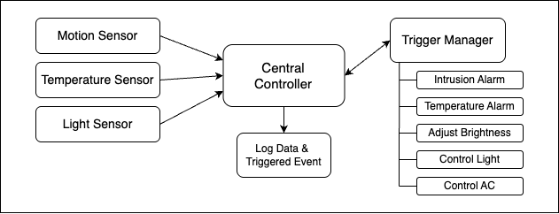

## System Architecture

The architecture of the Virtual Sensor System consists of the following components:

### Key Components:
1. **Sensors**:
   - Motion Sensor
   - Temperature Sensor
   - Light Sensor
   - All sensors generate data and send it to the Controller.

2. **Controller**:
   - Receives and processes data from sensors.
   - Sends the processed data to the Trigger Manager for event evaluation.
   - Logs all data and triggered events.

3. **Trigger Manager**:
   - Evaluates sensor data based on rules to identify events.
   - Five defined events include:
     - Intrusion Alarm
     - Temperature Alarm
     - Adjust Brightness
     - Control Lighting
     - Control AC

4. **Logger**:
   - Stores all sensor data and triggered events.
   - Supports visualization and analysis.
